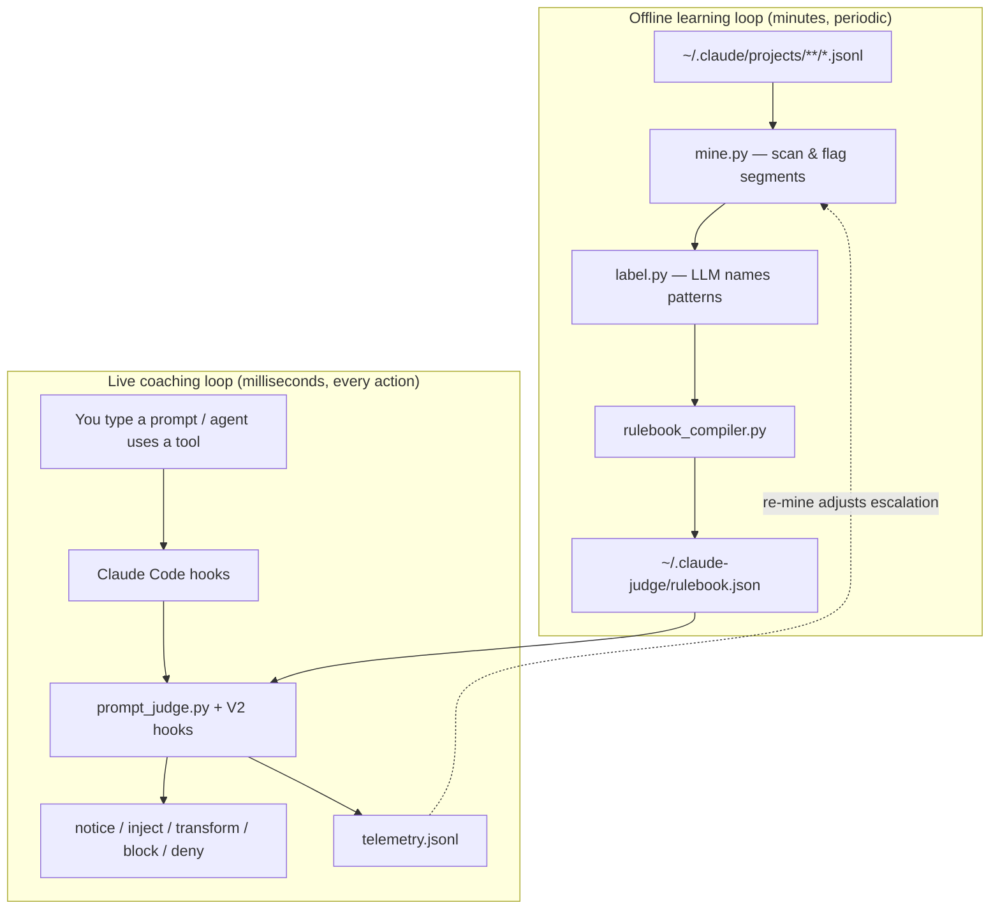

# AIDE — User Guide & Replication Reference

**AIDE** (Agent-assisted Individual Developer Effectiveness) is a local coaching layer for Claude Code. It watches how you work with a coding agent, learns your personal mistake patterns from past sessions, and intervenes in real time — only when the evidence says you are about to repeat an expensive or low-quality move.

Everything runs on your machine. Session transcripts stay local. The only optional LLM calls use your own CLI (`claude`, `agy`, or `codex`) during offline labeling — nothing is sent to a vendor API by this project itself.

This document is written for **you as a user** and for **any coding agent** that needs to understand, operate, or rebuild the system from scratch.

---

## 1. What problem does AIDE solve?

Working with coding agents has a hidden cost structure:

- **Tokens:** Most spend is re-reading session history every turn. Stale sessions, context stuffing, and web-fetch chains burn tokens silently.
- **Quality:** Vague prompts, blind retries, error dumps without repro steps, and mega-prompts produce correction loops.
- **Risk:** Shipping without verification, destructive commands under auto-accept, and marathon sessions without handoffs.

Generic “prompt better” advice fails because mistakes are **personal**. One developer retries blindly; another over-fetches docs; another skips tests before commit. AIDE learns *your* patterns from `~/.claude` history and coaches *you* with evidence, not platitudes.

**Analogy:** DORA metrics tell engineering leaders how delivery performs. AIDE is the personal equivalent for agent-assisted development — but the prototype ships the **real-time coach** first, not the quarterly dashboard.

---

## 2. What AIDE does (in one sentence)

**Offline:** scan your Claude Code session history → find suspicious moments → label recurring patterns → compile a personal **rulebook**.

**Live:** register hooks in Claude Code → on every prompt and tool call, evaluate deterministic rules + your rulebook → deliver a **notice**, **silent steer**, **prompt transform** ("prompt optimised"), or rare **block** → log telemetry → re-mine periodically to improve.

---

## 3. How it helps you

| Benefit | Mechanism |
|---------|-----------|
| **Lower token bills** | Nudges to `/clear` on stale resumption, stops web-fetch chains, reduces repo re-scanning |
| **Fewer correction loops** | Blocks blind retries, steers after error streaks, injects verification before “ship” |
| **Better prompts** | Flags vague openers, question stacking, mega-prompts; suggests `/plan` when you skip planning |
| **Safer automation** | Denies destructive bash under auto-accept; one-shot “verify before commit” on session stop |
| **Personalized coaching** | Mined patterns fire with messages tuned to *your* transcript evidence |
| **No surveillance design** | All data under `~/.claude-judge/` on your disk; org aggregation is a future product surface |

---

## 4. System overview

AIDE has two coupled loops:



### 4.1 The offline loop (learn)

1. **`mine.py`** walks `~/.claude/projects/**/*.jsonl` (configurable).
2. For each session it computes **signals**: corrections, retries, error streaks, web chains, token outliers, etc.
3. Suspicious **segments** (excerpts around bad moments) go into `shortlist.json`.
4. **`label.py`** sends batches of segments to an LLM via local CLI. The LLM proposes **patterns** with triggers over a fixed signal vocabulary.
5. Validation rejects hallucinated triggers (shape-only, partition pairs, always-true conditions).
6. **`rulebook_compiler.py`** merges generic class-C rules (templates, handoff rituals, correction clusters) with labeled patterns.
7. Output is archived under `~/.claude-judge/runs/YYYY-MM-DD_HHMMSS/` and published to `rulebook.json`.

**Incremental re-mine:** `scheduled_mine.py` runs `mine.py --since 7` in the background when the last run is older than 24 hours. Partial runs **merge** aggregates with the prior rulebook instead of replacing history.

### 4.2 The live loop (coach)

Claude Code calls Python hook scripts registered in `~/.claude/settings.json`. Each hook:

- Reads JSON **payload** from stdin (prompt, transcript path, session id, cwd, tool name, etc.).
- Loads **`rulebook.json`** and per-session **state** from `~/.claude-judge/`.
- Evaluates **tier-1 rules R1–R22** plus **mined patterns** from the rulebook.
- Applies a **fatigue budget** (max notices, blocks, injects per prompt/session).
- Prints JSON to stdout (Claude Code interprets it) and appends **telemetry**.

**Happy-path latency target:** under 150ms per `UserPromptSubmit`. No LLM in the hot path.

---

## 5. Flow diagram — what happens when you press Enter

```mermaid
sequenceDiagram
    participant U as You
    participant CC as Claude Code
    participant PJ as prompt_judge.py
    participant RB as rulebook.json
    participant AG as Agent

    U->>CC: Submit prompt
    CC->>PJ: UserPromptSubmit payload
    PJ->>PJ: turn_reset (web_chain, counters)
    alt trivial prompt or * bypass
        PJ-->>CC: exit 0 (silent)
    else evaluate rules
        PJ->>RB: load thresholds + patterns
        PJ->>PJ: compute_signals(prompt, transcript tail)
        PJ->>PJ: run_tier1 + run_rulebook
        PJ->>PJ: apply_budget (priority, caps)
        alt block (max 1/session)
            PJ-->>CC: decision block + reason
            CC-->>U: Show reason; prompt erased
        else notice
            PJ-->>CC: systemMessage
            CC-->>U: Visible nudge
        end
        opt inject
            PJ-->>CC: additionalContext
            CC->>AG: Prompt + silent steer
        end
    end
    AG->>CC: Tool call (e.g. WebFetch)
    CC->>PT: pretool_gate.py
    alt deny
        PT-->>CC: permissionDecision deny
        CC-->>AG: Tool blocked with reason
    else allow
        CC->>AG: Tool runs
        CC->>PO: posttool_record.py (update counters)
    end
```

---

## 6. What goes in — data sources

| Source | Path | Used for |
|--------|------|----------|
| Session transcripts | `~/.claude/projects/<encoded-path>/*.jsonl` | Mining, signal computation, transcript tail in judge |
| Live rulebook | `~/.claude-judge/rulebook.json` | Thresholds, patterns, escalation ladders, verify commands |
| Session marks | `~/.claude-judge/session_marks.json` | Per-session rule state (R2 overrides, r11 dedup, escalation rungs) |
| Session state | `~/.claude-judge/session_state/<session>.json` | V2 counters: web_chain, bash retry signatures |
| Telemetry | `~/.claude-judge/telemetry.jsonl` | Fire/override events; feeds escalation on re-mine |
| Compact snapshots | `~/.claude-judge/compact-memory/compact-*.md` | PreCompact recovery inject |
| Pending rewrite | `~/.claude-judge/pending_transform.md` | Last transform's optimized prompt; `/aide` inspects, `/aide run` re-runs |
| Hook settings | `~/.claude/settings.json` | Registers all AIDE hook commands |

### 6.1 What the judge reads from each prompt

From the **incoming prompt** (text you typed):

- Word count, file references, question marks, imperative task count
- Similarity to recent / failed prompts
- Plan markers (`/plan`, “before editing”, etc.)
- Research intent, handoff phrases, internal tool names (`WebFetch`, `mcp__…`)
- Stack traces without repro markers

From the **transcript tail** (last ~512KB of JSONL):

- Token usage (input + cache read) of last assistant turn with usage
- Tool errors, corrections, test commands run
- Web-fetch chains, edit-before-read counts
- Session age, idle time, compaction continuation messages

From the **repo** (`cwd`):

- `CLAUDE.md` / `AGENTS.md` presence
- Git repo detection

From **mined rulebook**:

- Personal pattern triggers
- Calibrated thresholds (stale hours, web chain min, marathon hours)
- Per-project `verify_commands`
- Escalation ladders (inject → notice → block/pretool)

---

## 7. What does NOT go in — explicit non-goals

AIDE deliberately **does not**:

| Non-goal | Why |
|----------|-----|
| **Rewrite your prompt literally** | Claude Code hooks cannot replace `UserPromptSubmit` text (no `updatedPrompt` field). Transforms deliver the rewrite as authoritative `additionalContext` the agent acts on — functionally a rewrite, with one "prompt optimised" line visible. |
| **Call an LLM on every keystroke** | Latency and cost. Hot path is deterministic only. |
| **Send data to external APIs** | Trust model: local transcripts, local rulebook, local telemetry. |
| **Fire on elapsed time alone** | A 30-hour-old session costs nothing until you resume. Time is a **gate**, not a trigger. |
| **Duplicate native Claude UX** | Generic “this chat is old” is skipped when compaction continuation or native resume already handled it. |
| **Surveil teammates** | Prototype is single-user. Org dashboards are a separate product surface. |
| **Timer popups or modal interrupts** | Interventions are notices, injects, blocks, or tool denies — all hook-native. |
| **“Ignore user input” system overrides** | Rejected pattern from prior art. Steers are structured artifacts, not adversarial prompts. |
| **Auto-promote mined patterns to blocking** | New patterns start as `proposed` / inject-only until you confirm. |
| **Judge tier-2 LLM ambiguity** | Deferred. Not in prototype hot path. |

**Trivial prompts are skipped:** empty, slash-commands, hash-commands, or ≤2 words (e.g. `ok`, `continue`) exit silently — but `turn_reset` still runs so counters stay accurate.

**Power-user bypass:** prefix any prompt with `*` to skip rule evaluation for that turn.

---

## 8. The three intervention channels

Every live intervention uses one or more of these channels:

### 8.1 Inject (silent steer)

- **You see:** nothing (usually).
- **Agent sees:** extra `additionalContext` alongside your prompt.
- **Use when:** high-volume waste patterns — web chains, repo dumps, verification packets, error-diagnosis XML.
- **Example packet (R18 web-fetch chain):**

```xml
<source_policy expires="after_this_turn">
The previous run fetched 14 web pages in a row. Summarize what was already fetched and prefer repo/local evidence next. Use the web again only if specific external docs are required.
</source_policy>
```

### 8.2 Notice (visible nudge)

- **You see:** `systemMessage` in the UI — a short `[judge] …` line.
- **Agent sees:** may also get injects separately.
- **Use when:** actionable hygiene — stale resumption, missing CLAUDE.md, marathon session, plan redirect.
- **Example (R11 stale resumption):**

```
[judge] Resuming after ~26h idle with ~30k carried tokens and 2 recent correction(s) — this looks like a NEW task in an old shell. /clear or /compact first unless you need the history.
```

### 8.3 Transform ("prompt optimised")

- **You see:** exactly one line — `✦ prompt optimised — <what was fixed> (rule)`.
- **Agent:** receives your original prompt **plus** an authoritative `<optimized_prompt>` context packet and acts on the optimized version.
- **Use when:** the prompt matches a fixable bad pattern — repeat of a failed prompt (R2), raw error dump (R21), bundled asks (R6), stacked questions (R13), vague opener (R5).
- **Example (R2 repeat-failed prompt) — what the agent is directed to act on:**

```
<previous_attempt_summary>
A nearly identical prompt just failed. Last error: FAIL
</previous_attempt_summary>
<request>
Do not repeat the previous approach. First diagnose why the last attempt failed
(root cause, not symptom). If required information is missing, ask ONE targeted
question. Then apply the smallest fix and verify it.
</request>
<original_prompt>
fix the auth middleware
</original_prompt>
```

Nothing blocks and nothing needs resubmitting — press enter, keep working. The rewrite is saved to `~/.claude-judge/pending_transform.md`; type **`/aide`** to inspect it or **`/aide run`** to re-run it. Prefix a prompt with `*` to bypass AIDE for that turn.

Structure is deterministic (<150ms). For R5/R6 the wording can be polished by Haiku (`optimizer.llm` config; validated, falls back to the deterministic skeleton).

### 8.3b Block (prompt erased — rulebook patterns only)

Built-in rules never block anymore. Only mined rulebook patterns with earned `rights.blocking` can block, capped at **1 block per session**.

### 8.4 PreTool deny (V2 — invisible tool gate)

- **You see:** agent explains the tool was denied.
- **Mechanism:** `pretool_gate.py` returns `permissionDecision: deny`.
- **Triggers:** web chain ≥ threshold (default 12), same bash command failed ≥3×, destructive command under auto-accept.

---

## 9. Fatigue budget — how multiple rules interact

When several rules fire at once:

| Limit | Value | Behavior |
|-------|-------|----------|
| Notices per prompt | 1 | Highest-priority stdout wins (R2/R9 beat R11 beat R3…) |
| Notices per session | 3 | Further notices suppressed |
| Blocks per session | 1 | Second block demotes to notice |
| Injects per prompt | 2 | Overflow merged into `<carry_forward>…</carry_forward>` |
| Rule cooldown | 10 prompts | R18, R19, R20 won’t re-fire immediately |

**Priority order (lower number wins for notices):** R2 (0), R9 (1), R1/R10/R11/R12 (10), R18 (8), R19 (9), R3 (20), R5/R13 (30), …

Each rule carries its own message payload — notices and injects are never misaligned by position in a list.

---

## 10. Tier-1 rules reference (built-in)

These ship in `prompt_judge.py` and do not require mining:

| Rule | Class | Channel | When it fires |
|------|-------|---------|---------------|
| **R1** | B | notice | New task boundary but ≥40% context window carried |
| **R2** | B | transform→notice | Prompt ≥85% similar to one that had tool errors; notice after 2 overrides |
| **R3** | B | notice + inject | ≥3 consecutive error turns or ≥2 recent corrections |
| **R4** | B | notice | Git repo without CLAUDE.md (once/session) |
| **R5** | A | transform | First prompt vague (“fix it”) without file refs |
| **R6** | A | transform | ≥4 imperative asks in one prompt |
| **R7** | B | inject | Ship language without test evidence this session |
| **R9** | B | notice | About to ship with no tests/builds run |
| **R10** | B | notice | Idle >5min with large context (cache expired) |
| **R11** | B | notice | Stale resumption: idle >12h, >20k carried tokens, short prompt |
| **R12** | B | notice | Session wall clock >24h or >60 turns |
| **R13** | A | inject | ≥3 question marks, short prompt |
| **R14–R16** | C | notice/inject | Mined template / handoff / correction-cluster matches |
| **R17** | B | notice + inject | Bash retry spiral retrospective |
| **R18** | B | inject | Previous turn had long web-fetch chain |
| **R19** | B | inject | Many file reads before first edit |
| **R20** | B | inject | Context stuffing (cache read spike) |
| **R21** | A | inject | Stack trace pasted without repro markers |
| **R22** | C | notice/inject | Multi-part change, plan-skipping history, no plan marker |

---

## 11. Personalized patterns (mined)

After `mine.py` + `label.py`, your rulebook gains `patterns[]` entries like:

```json
{
  "id": "pat_retry_without_new_information",
  "aggregation_key": "retry_without_new_information",
  "category": "recovery",
  "title": "Retry without new information",
  "trigger": {
    "all": [
      {"signal": "prompt_similarity_to_failed", "op": ">=", "value": 0.8},
      {"signal": "prompt_word_count", "op": ">=", "value": 8}
    ]
  },
  "action": {
    "channel": "inject",
    "message": "Your prompt closely repeats one that already failed. Say what the last attempt got wrong before retrying."
  },
  "user_status": "proposed",
  "stats": {"occurrences": 4, "last_seen": "2026-07-09"},
  "rights": {"blocking": false}
}
```

**Pattern lifecycle:**

| `user_status` | Effect |
|---------------|--------|
| `proposed` | Inject only (stdout candidates demoted to inject) |
| `confirmed` | Keeps channel; can earn blocking if `rights.blocking` true |
| `muted` | Never fires |
| `candidate` | Compiled class-C rules from miner (inject until confirmed) |

---

## 12. V2 hooks — beyond the prompt

| Hook | Script | What it does |
|------|--------|--------------|
| **UserPromptSubmit** | `prompt_judge.py` | Main judge: rules + rulebook + budget |
| **PreToolUse** | `pretool_gate.py` | Deny web chains, bash spirals, destructive-under-auto |
| **PostToolUse** | `posttool_record.py` | Increment web_chain; track bash stderr signatures |
| **PostToolUseFailure** | `posttool_record.py` | Same recorder on bash failures |
| **SessionStart** | `session_start.py` | Resume recap; sets `r11_delivered` to dedup R11 |
| **SessionStart (async)** | `scheduled_mine.py` | Background re-mine if stale >24h |
| **PreCompact** | `precompact.py` | Write `compact-memory/compact-*.md` snapshot |
| **Stop** | `stop_verify.py` | Once per session: edits but no tests → verify nudge |
| **`/aide` command** | `commands/aide.md` | Inspect or re-run the last saved optimization |

---

## 13. Example scenarios

### Scenario A — Stale session, new task

**You:** Open a 2-day-old chat, type `continue where we left off`.

**Signals:** 30k carried tokens, 26h since last event, low similarity to recent work, correction history.

**You see (R11):**
```
[judge] Resuming after ~26h idle with ~30k carried tokens and 1 recent correction(s) — this looks like a NEW task in an old shell. /clear or /compact first unless you need the history.
```

**Why useful:** Native UI says “old chat.” AIDE quantifies *your* correction count and token carry — evidence native UX lacks.

---

### Scenario B — Web research spiral

**You:** Ask agent to research an API. It fetches 12+ pages in one turn. You type `keep going`.

**Inject (R18):** `<source_policy>…summarize before fetching more…</source_policy>`

**If agent tries another WebFetch:** PreTool **denies** with “14 consecutive web fetches…”

**Why useful:** Stops token burn mid-spiral, not after the bill arrives.

---

### Scenario C — Blind retry

**You:** Prompt fails with test errors. You retype the same prompt.

**Transform (R2):** Prompt passes through, but the agent is directed to act on a diagnose-first rewrite instead of blindly retrying. You see one line — `✦ prompt optimised — repeat of a failed prompt rewritten as a diagnose-first retry (R2)`. The rewrite is also saved to `pending_transform.md`.

**You:** Nothing to resubmit — keep working. Type `/aide` only if you want to inspect the rewrite the agent acted on.

**After 2 transforms:** R2 demotes to a plain notice (fatigue + earned demotion). Built-in rules never erase your prompt — only mined rulebook patterns that have earned `rights.blocking` can block, capped at 1/session.

---

### Scenario D — Error paste without context

**You:** Paste `TypeError: undefined is not a function` with stack trace, no repro steps.

**Inject (R21):**
```
The user pasted an error without reproduction context. Treat it as:
<error_report>…</error_report>
Identify the root cause before editing…
```

**Agent behavior:** Diagnoses before editing instead of guessing.

---

### Scenario E — Ship without tests

**You:** `commit and push the auth changes`

**Notice (R9):** “You're about to ship changes this session, but no tests or builds have run…”

**Inject (R7):**
```xml
<verification confidence="high">
  <commands>
    npm test
    npm run lint
  </commands>
  <evidence_required>State pass/fail output before claiming done.</evidence_required>
</verification>
```

**On Stop (if you quit without testing):** One-shot `[judge/stop] This session has file edits but no test/build evidence yet.`

---

### Scenario F — Mined personal pattern

**History shows:** You often dictate internal tool names (`use WebFetch on…`) and the agent misconfigures tools.

**Pattern (when confirmed):** Inject reminding you to describe *what* you need, not *which* tool.

**If false-positive:** Set `user_status: "muted"` in rulebook (or wait for validation to reject shape-only triggers on re-label).

---

## 14. Installation & daily operation

### First-time setup

```bash
cd prototype

# 1. Learn from your history
python3 miner/mine.py              # full scan (or --since 30)
python3 miner/label.py             # --dry-run first; needs local LLM CLI

# 2. Register hooks (merges into ~/.claude/settings.json)
python3 judge/install_hooks.py

# 3. /aide command is copied automatically
```

### Uninstall hooks

```bash
python3 prototype/judge/install_hooks.py --uninstall
```

### What runs automatically

- Every **prompt** → judge evaluates rules
- Every **Bash/WebFetch/WebSearch** → pre/post tool hooks
- Every **new session** → resume recap + optional background re-mine
- Every **compact** → snapshot written
- Every **stop** → verify nudge (once)

### Manual refresh

```bash
python3 miner/mine.py --since 7
python3 miner/label.py --run-id <latest>
```

### Environment tuning

| Variable | Default | Meaning |
|----------|---------|---------|
| `CLAUDE_JUDGE_HOME` | `~/.claude-judge` | All runtime data |
| `AIDE_MINE_ENABLED` | `1` | Disable background re-mine |
| `AIDE_MINE_INTERVAL_HOURS` | `24` | Min hours between mines |
| `AIDE_MINE_SINCE_DAYS` | `7` | Incremental scan window |
| `JUDGE_LABEL_BACKEND` | `claude` | `agy` or `codex` for labeling |

---

## 15. Replication guide for coding agents

To rebuild AIDE from this document, implement these components in order.

### Phase A — History miner

1. **Session parser** (`session_features.py`): walk JSONL; extract user prompts (exclude continuation summaries, tool results); attach tool uses/results; compute per-session features.
2. **Generic detectors** (`generic_detectors.py`): flag segments with correction phrases, retry similarity ≥0.8, error streaks ≥3.
3. **Cross-session aggregate** (`cross_session.py`): template signatures, correction keyword clusters, handoff stats, base rates per pattern.
4. **Mine orchestrator** (`mine.py`): scan → shortlist → aggregates → `compile_rulebook()` → write reports (`findings_report.md`, `change_first.md`, `dashboard_data.json`).
5. **Archive layout** (`judge_store.py`): `runs/<timestamp>/` immutable; `latest.json` pointer; publish `rulebook.json`.

### Phase B — Labeling

1. **Signal vocabulary** — fixed list shared between labeler and judge (see `label.py` `SIGNAL_VOCAB`).
2. **LLM batch labeling** — 10 segments per call; merge by `aggregation_key`.
3. **Validation** — reject bad keys, <2 supporting segments, unknown signals, always-true triggers, shape-only triggers, partition pairs.
4. **Idempotent merge** — evidence deduped by `(session_id, turn)`; occurrences = len(evidence).

### Phase C — Real-time judge

1. **`compute_signals()`** — single function; transcript tail + prompt + rulebook + cwd → dict of numeric/bool signals.
2. **`run_tier1()`** — R1–R22; each returns `fire_record(rule, class, emits[])`.
3. **`run_rulebook()`** — evaluate `patterns[]` triggers against signals; respect `user_status`.
4. **`apply_budget()`** — priority sort; session caps; block demotion; inject merge.
5. **`main()`** — read stdin JSON; `turn_reset` before early exits; write stdout JSON + telemetry.

**Hook output schemas:**

```json
// Pass — exit 0, no stdout

// Notice
{"systemMessage": "[judge] …"}

// Inject
{"hookSpecificOutput": {"additionalContext": "…"}}

// Block
{"decision": "block", "reason": "…"}

// PreTool deny
{"hookSpecificOutput": {"hookEventName": "PreToolUse", "permissionDecision": "deny", "permissionDecisionReason": "…"}}
```

### Phase D — V2 hooks

1. **`session_state.py`** — per-session JSON: `web_chain`, `research_intent`, `bash` retry map, `stop_verify_fired`.
2. **`posttool_record.py`** — update counters after tool use.
3. **`pretool_gate.py`** — read counters; deny before tool executes.
4. **`scheduled_mine.py`** — `O_EXCL` lock; spawn detached `mine.py --worker`.
5. **`stop_verify.py`** — once-per-session flag in session state (not reset per turn).

### Phase E — Installer

`install_hooks.py` merges hook entries tagged with `prototype/judge/` path marker; backs up settings; supports `--uninstall`.

### Phase F — Tests

Minimum test coverage to verify correctness:

- Notice/inject alignment when R3 + R11 co-fire
- Inject merge and `<carry_forward>` overflow
- `stop_verify` silent on second stop
- `*` bypass still resets `web_chain`
- Shape-only label rejection; partial mine aggregate merge
- Idempotent label merge occurrences

```bash
cd prototype/judge && python3 -m unittest test_prompt_judge.py test_hooks_v2.py -v
cd prototype/miner && python3 -m unittest discover -p 'test_*.py' -v
```

---

## 16. File map (prototype checkout)

```
prototype/
  judge/
    prompt_judge.py       # UserPromptSubmit — core judge
    session_state.py      # V2 per-session counters
    pretool_gate.py       # PreToolUse deny
    posttool_record.py    # PostToolUse recorder
    session_start.py      # SessionStart recap
    scheduled_mine.py     # Background re-mine
    precompact.py         # PreCompact snapshot
    stop_verify.py        # Stop verification nudge
    install_hooks.py      # Install / uninstall
    judge_store.py        # Run archives, DETECTOR_VERSION
    commands/aide.md        # /aide slash command
  miner/
    mine.py               # Offline scan
    label.py              # LLM labeling
    rulebook_compiler.py  # Rulebook v2 compiler
    session_features.py   # JSONL parser
    generic_detectors.py  # Segment flagging
    cross_session.py      # Aggregates + calibration
    web_export.py         # Dashboard JSON

~/.claude-judge/          # Runtime (created on first mine)
  rulebook.json
  telemetry.jsonl
  session_marks.json
  session_state/
  compact-memory/
  runs/<timestamp>/
  latest.json
```

---

## 17. Known limitations

- **No prompt rewrite** — only block + suggest, or inject beside.
- **Tier-2 LLM judge** — not in hot path; ambiguous cases are not LLM-adjudicated live.
- **Thresholds** — calibrated from your baseline after first mine; wrong for day-one users until history exists.
- **PreTool counters** — use `session_state`, not transcript (transcript_path can be stale in PreTool).
- **Re-mine republish** — can overwrite manual mutes unless you re-mute or fix compiler to preserve `user_status: muted`.
- **Single user** — no team dashboard in prototype.

---

## 18. Further reading

| Document | Contents |
|----------|----------|
| `prototype/README.md` | Quick install, hook JSON, test commands |
| `README.md` | One-command install, commands, privacy |

---

## 19. Summary

AIDE is a **personal coach** for Claude Code: it learns from your session history, compiles a rulebook, and intervenes at the moment of action — with notices you can glance at, injects the agent reads silently, rare blocks that save you from blind retries, and tool gates that stop spirals mid-flight. It measures **process** (how you delegate) separately from **output** (what lands in the repo), stays local, respects fatigue limits, and improves over time as telemetry and re-mines adjust escalation.

A coding agent replicating this project should implement: **miner → labeler → rulebook → hook judge → telemetry → re-mine**, with deterministic signals end-to-end and LLM involvement confined to offline labeling.
